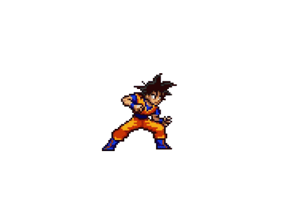

# Floatask

A macOS floating task manager that lives as a draggable Goku bubble on your desktop and expands into a clean task card.



---

## Features

- **Floating bubble** — always-on-top, transparent, draggable Goku GIF that never gets in your way
- **Task card** — click the bubble to expand a 320×480 card with a full task list
- **Animated count** — when you have incomplete tasks, a Dragon Ball-style gold badge animates at the end of the GIF loop
- **Daily carry-over** — on first open each day, prompts you to keep or clear yesterday's incomplete tasks
- **Quick add** — press `+` in the header and hit Enter to add a task inline
- **Persistent** — tasks and window position saved to `~/Library/Application Support/floatask/tasks.json`
- **Single instance** — launching a second copy focuses the existing window instead
- **No dock icon** — lives entirely in the background (macOS Accessory activation policy)

---

## Requirements

| Tool | Version | Install |
|------|---------|---------|
| macOS | 12 Monterey+ | — |
| Xcode Command Line Tools | latest | `xcode-select --install` |
| Rust + Cargo | 1.77+ | [rustup.rs](https://rustup.rs) |
| Node.js | 18+ | [nodejs.org](https://nodejs.org) |
| Python 3 | 3.10+ | pre-installed on macOS or via [python.org](https://www.python.org) |

---

## Setup

### 1. Clone the repo

```bash
git clone https://github.com/Sounak123/floatask.git
cd floatask
```

### 2. Install Node dependencies

```bash
npm install
```

### 3. Set up the Python environment for GIF generation

Floatask uses a small Python script (Pillow) to bake the task count into the Goku GIF at runtime. A dedicated venv keeps this isolated from your system Python.

```bash
python3 -m venv /tmp/gifenv
/tmp/gifenv/bin/pip install Pillow
```

> **Note:** The venv lives in `/tmp/` so it is wiped on reboot. Re-run the two commands above after a restart if the count badge stops updating.
>
> To make it permanent, change the path in `src-tauri/src/commands.rs` (`regenerate_gif` function) and `scripts/make_gif.py` from `/tmp/gifenv` to a stable location like `~/.gifenv`, then rebuild.

### 4. Verify the GIF script works

```bash
/tmp/gifenv/bin/python3 scripts/make_gif.py 3 public/goku-base.gif public/goku.gif
# Expected: Saved 62 frames → public/goku.gif
```

---

## Running in development

```bash
npm run tauri dev
```

This starts the Vite dev server and compiles the Tauri backend. The bubble appears on screen within ~30 seconds on first run (Rust compile), then near-instantly on subsequent runs.

> The app has no dock icon by design. If you can't find it, look for the Goku bubble floating on your desktop — it defaults to the top-right corner on first launch.

---

## Building for production

```bash
npm run tauri build
```

The `.app` bundle is output to `src-tauri/target/release/bundle/macos/Floatask.app`.

> **Note:** The production bundle still requires the Python venv at `/tmp/gifenv` to regenerate the count GIF at runtime. If you want a fully self-contained build, embed Python or replace the GIF generation with a Rust-native image library.

---

## Project structure

```
floatask/
├── public/
│   ├── goku-base.gif        # Source transparent GIF (never modified)
│   └── goku.gif             # Generated output GIF (count baked in)
├── scripts/
│   └── make_gif.py          # Appends animated Dragon Ball count to GIF
├── src/
│   ├── App.tsx              # Root — mode state machine, task CRUD, carry-over
│   ├── store.ts             # Tauri invoke wrappers
│   ├── types.ts             # TypeScript interfaces
│   ├── components/
│   │   ├── Bubble.tsx       # Draggable GIF bubble
│   │   ├── Card.tsx         # Card shell
│   │   ├── Header.tsx       # Title + collapse + add buttons
│   │   ├── QuickAdd.tsx     # Slide-down input
│   │   ├── TaskList.tsx     # Sorted task list
│   │   ├── TaskRow.tsx      # Single task row
│   │   └── CarryOverDialog.tsx  # Day-change modal
│   └── styles/
│       ├── global.css       # CSS variables, reset
│       └── components.css   # All component styles
├── src-tauri/
│   ├── tauri.conf.json      # Window config (72×72, transparent, alwaysOnTop)
│   ├── capabilities/
│   │   └── default.json     # Tauri 2 ACL permissions
│   └── src/
│       ├── main.rs          # App entry, single-instance, activation policy
│       └── commands.rs      # Rust commands: data I/O, window management, GIF gen
└── package.json
```

---

## Data storage

Tasks and window position are stored as JSON at:

```
~/Library/Application Support/floatask/tasks.json
```

Example:

```json
{
  "tasks": [
    {
      "id": "abc123",
      "text": "Buy groceries",
      "completed": false,
      "created_at": "2026-07-15T10:00:00Z"
    }
  ],
  "last_opened_date": "2026-07-15",
  "window_position": { "x": 2400, "y": 52 }
}
```

To reset the app to factory state:

```bash
rm ~/Library/Application\ Support/floatask/tasks.json
```

---

## Usage

| Action | How |
|--------|-----|
| Expand to card | Click the bubble |
| Collapse back | Click `↙` in the card header |
| Add a task | Click `+` in the header, type, press `Enter` |
| Complete a task | Check the checkbox |
| Delete a task | Hover the row, click `×` |
| Move the bubble | Click and drag |
| Quit | Right-click the bubble → confirm |

---

## Troubleshooting

**Count badge not showing / GIF not updating**

The Python venv was likely cleared (reboot or `/tmp` clean). Re-create it:

```bash
python3 -m venv /tmp/gifenv
/tmp/gifenv/bin/pip install Pillow
```

Then add or complete a task to trigger regeneration.

**Bubble not visible after launch**

The window defaults to the top-right corner. It has no dock icon — check all corners of all displays. If the saved position is off-screen, delete `tasks.json` (see Data storage above) and relaunch.

**Two instances running**

The single-instance lock is enforced at the Tauri level (OS mutex). If you somehow end up with two, kill the older one:

```bash
pkill -o floatask
```

**`cargo tauri dev` fails with Rust errors**

Make sure Rust is up to date:

```bash
rustup update stable
```

---

## License

MIT
